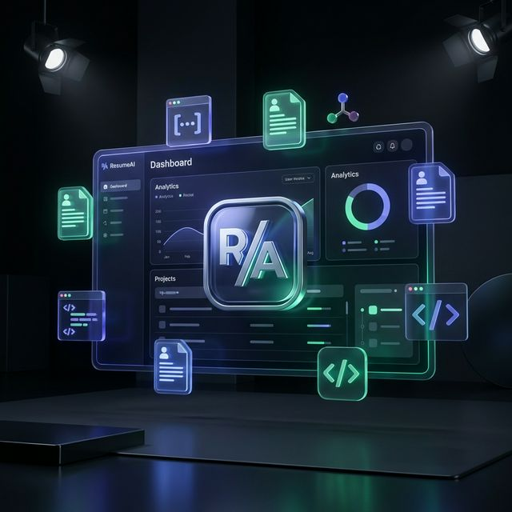

# 🚀 ResumeAI & Portfolio Builder



### **The Intelligent Branding Platform for Modern Professionals**

**ResumeAI** is a premium SaaS platform designed to bridge the gap between your experience and a professional online presence. In minutes, transform your raw data into **ATS-optimized resumes** and **fully-functional, production-ready portfolios**.

[Live Demo](http://localhost:3000)

---

## ✨ Key Features

### 📄 AI Resume Builder
- **ATS Intelligence**: Advanced algorithms that scan and score your resume against recruitment filters.
- **Smart Rewriting**: AI-driven bullet point optimization focused on quantification and impact.
- **Multi-Format Export**: One-click downloads for PDF and DOCX formats.
- **Version History**: Save, duplicate, and track every iteration of your professional growth.

### 🌐 Portfolio Engine
- **Agent Mode**: A structured AI questionnaire that generates a complete Next.js site based on your personality.
- **Template Mode**: Choose from sleek, modern themes including *Developer Dark*, *Agency Pro*, and *Minimal Light*.
- **Live Sandbox**: A high-fidelity preview environment with a simulated browser chrome.
- **Deployment Ready**: Download full source code as a ZIP and deploy to Vercel in seconds.

### 🎨 Premium Aesthetics
- **Modern UI/UX**: Built with a sleek dark-mode first philosophy using Glassmorphism and high-end micro-animations.
- **Responsive by Design**: Every resume and portfolio is perfectly optimized for mobile, tablet, and desktop screens.

---

## 🛠️ Tech Stack

| Layer | Technology |
| :--- | :--- |
| **Framework** | [Next.js 14](https://nextjs.org/) (App Router) |
| **Language** | [TypeScript](https://www.typescriptlang.org/) |
| **Styling** | [Tailwind CSS](https://tailwindcss.com/) & [Shadcn UI](https://ui.shadcn.com/) |
| **Animations** | [Framer Motion](https://www.framer.com/motion/) |
| **Database** | [MongoDB](https://www.mongodb.com/) (Mongoose) |
| **Auth** | [NextAuth.js](https://next-auth.js.org/) |
| **AI** | [Google Gemini](https://ai.google.dev/) & [Ollama](https://ollama.ai/) |

---

## 🚀 Getting Started

### 1. Prerequisites
- Node.js 18+
- MongoDB instance (or Atlas URI)
- Google Gemini API Key

### 2. Installation
```bash
# Clone the repository
git clone https://github.com/your-username/resumeai_resume_portfolio_builder.git

# Install dependencies
npm install

# Setup environment variables
cp .env.example .env.local
```

### 3. Environment Variables
Edit your `.env.local` with the following:
```env
GEMINI_API_KEY=your_key
MONGODB_URI=your_mongodb_uri
NEXTAUTH_SECRET=your_secret
NEXTAUTH_URL=http://localhost:3000
```

### 4. Run Development Server
```bash
npm run dev
```

---

## 🚢 Deployment

1. **Push to GitHub**: Initialize a repository and push your project.
2. **Connect to Vercel**: Import the repository and add your environment variables.
3. **Go Live**: Your site is now live on your custom `.vercel.app` domain.

---

## 💎 Pro Tier Features
Unlock the full power of professional branding:
- [x] Unlimited AI Content Generations
- [x] Full Source Code Downloads (ZIP)
- [x] Premium "Agency Pro" Template Access
- [x] Advanced ATS Matching Analysis
- [x] No Watermarks on Exports

---

## 🤝 Contributing
Contributions are what make the open-source community such an amazing place to learn, inspire, and create. Any contributions you make are **greatly appreciated**.

---


<p align="center">Built with ❤️ for the Developer Community</p>
